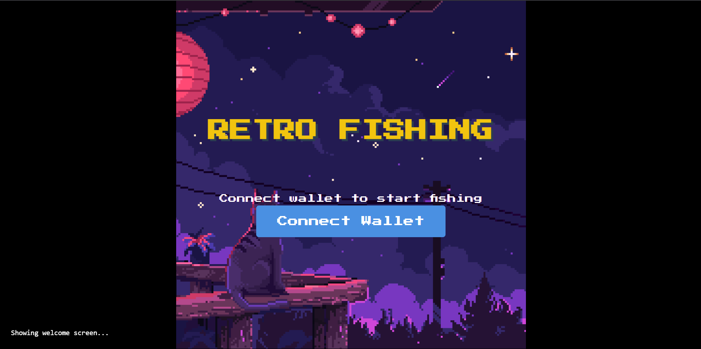
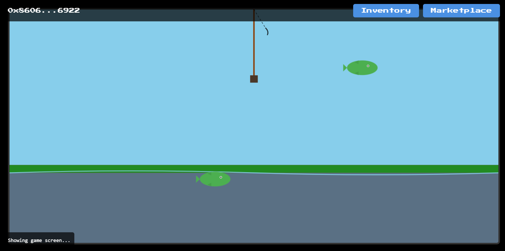

# Retro Fishing Game

## Overview

The Retro Fishing Game is a web-based game that allows users to connect their wallet, fish for different types of fish, and manage their inventory. The game features a retro-style UI with pixel art graphics and background music. The game is deployed on Base Chain (Base Sepolia testnet), providing a secure and efficient blockchain infrastructure.

## Screenshots

  
   <em>Welcome Screen</em>

  
   <em>Game Screen</em>

## Assets

All game art, music, and supporting files are located in the [`/src/assets`](src/assets) folder, including:
- Pixel art backgrounds and sprites
- Animated GIFs
- SVGs for UI and game elements
- Background music and sound effects

## Features

- **Welcome Screen**: Displays a retro-style welcome message with a background GIF and background music.
- **Wallet Connection**: Users can connect their wallet to start fishing.
- **Game Screen**: A canvas-based game where users can fish for different types of fish.
- **Inventory Management**: Users can view their caught fish and manage their inventory.
- **Marketplace**: Users can sell their fish in the marketplace.
- **Responsive Design**: The game is designed to be responsive and work on different screen sizes.

## Tech Stack

- **Frontend**: HTML, CSS, JavaScript
- **Web3**: Ethereum wallet integration
- **Graphics**: Canvas for game rendering
- **Audio**: HTML5 Audio for background music
- **Blockchain**: Base Chain (Base Sepolia testnet)
- **Smart Contracts**: Solidity

## Smart Contracts

The game uses two main smart contracts deployed on Base Sepolia testnet:

1. **FishingGameNFT**: Handles the NFT functionality for caught fish
   - Address: [0x4A7Ff7f24f553ed5ec9df7f03893a71C7EC13893](https://sepolia.basescan.org/address/0x4A7Ff7f24f553ed5ec9df7f03893a71C7EC13893#code)

2. **FishMarketplace**: Manages the marketplace for buying and selling fish
   - Address: [0x5ff1F6e18119Af6978D75a1aE21E4350050353af](https://sepolia.basescan.org/address/0x5ff1F6e18119Af6978D75a1aE21E4350050353af#code)

## Future Enhancements

- **Multiplayer Support**: Allow users to fish together and compete for the best catch.
- **Additional Fish Types**: Introduce more fish types with unique characteristics.
- **Achievement System**: Implement an achievement system to reward users for their fishing skills.
- **Enhanced Graphics**: Improve the graphics with more detailed pixel art and animations.
- **Sound Effects**: Add sound effects for catching fish and other game events.

## Getting Started

1. Clone the repository.
2. Install dependencies using `npm install`.
3. Run the game using `npm start`.
4. Connect your wallet (MetaMask or other Web3 wallet) to Base Sepolia testnet.

## Contributing

Please read the [Code of Conduct](CODE_OF_CONDUCT.md) before contributing to the project.

## License

This project is licensed under the GPL License. See the [LICENSE](LICENSE) file for details. 